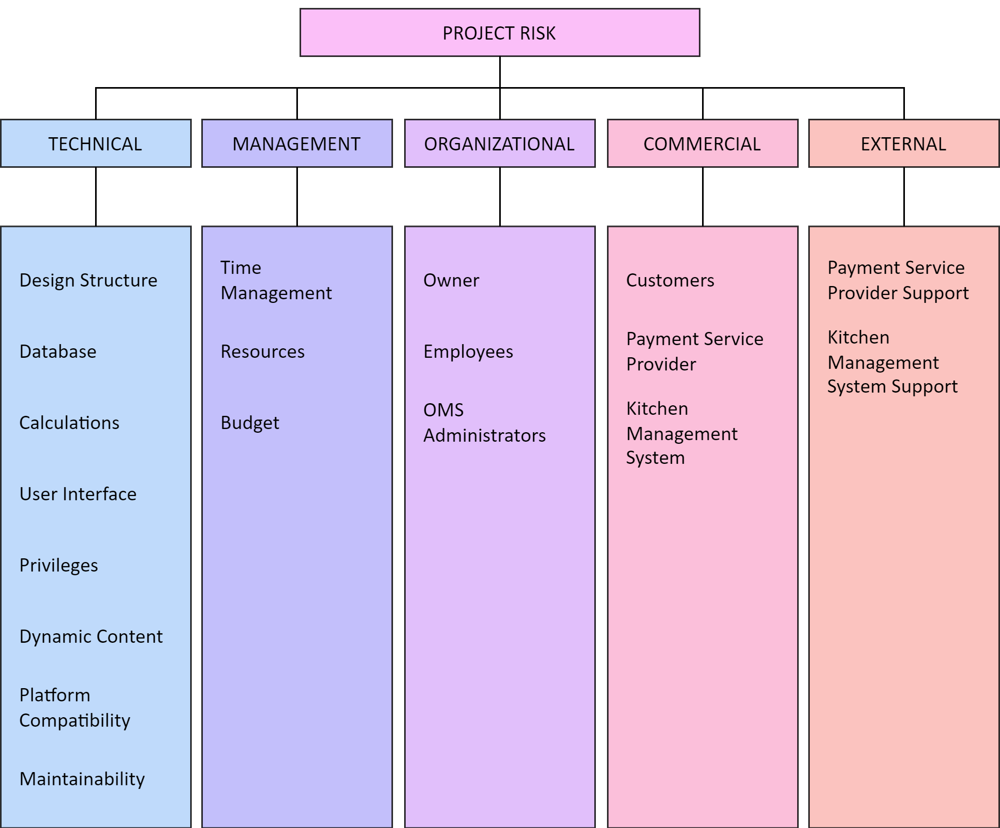
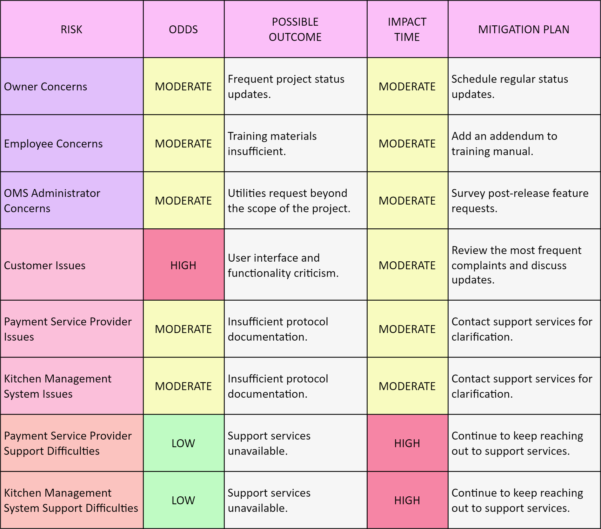
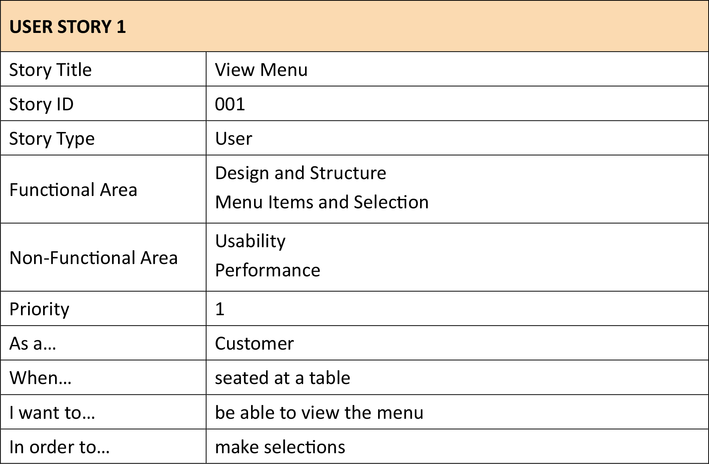
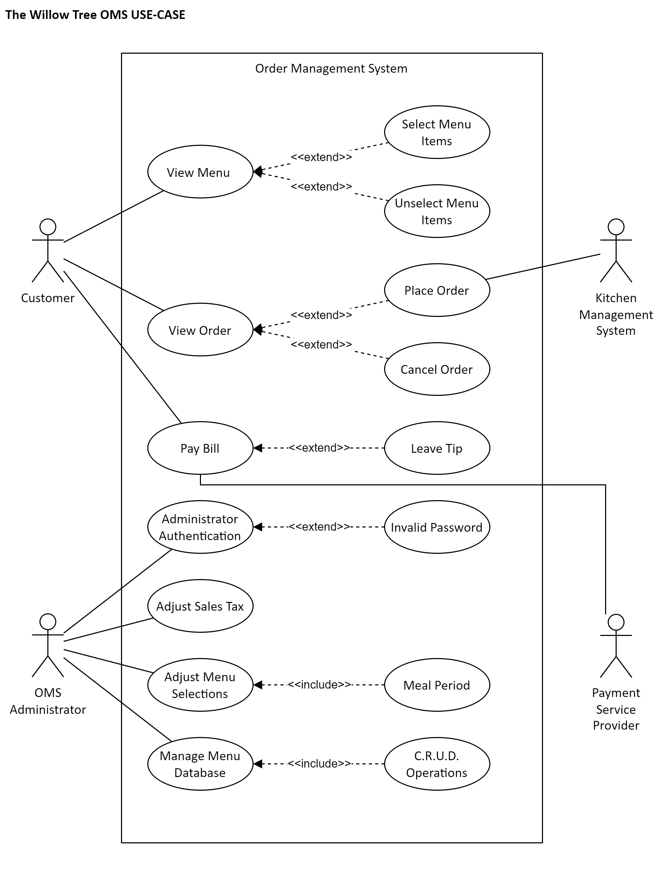
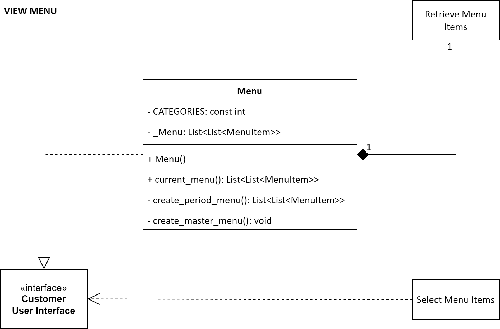
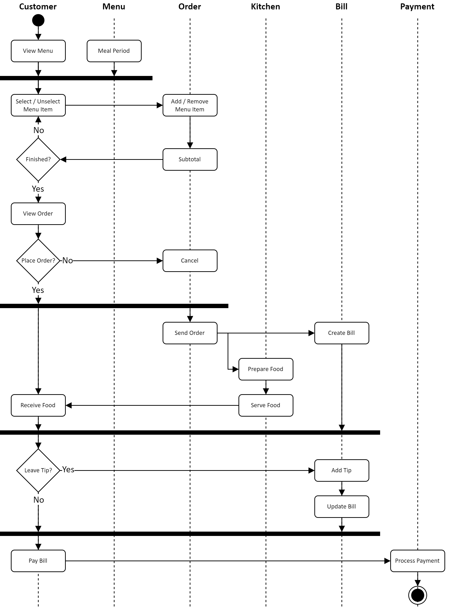
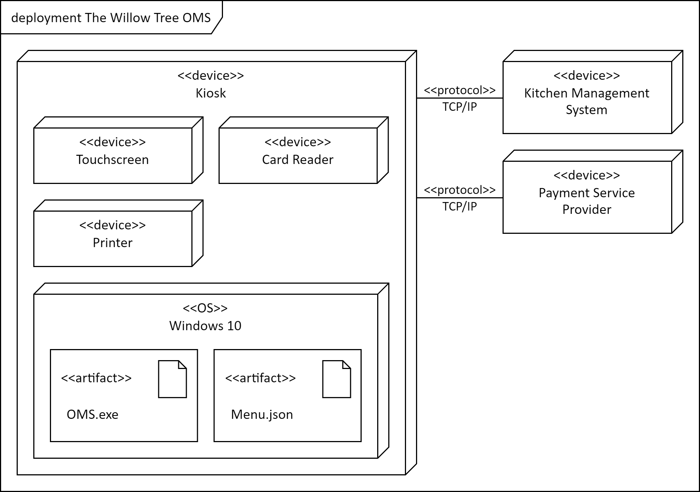

# The Willow Tree OMS

Professional Development for Computer Science  
Capstone Project  
 
Mark Sarasua, Jr.  
Ernst Bekkering, Ph.D.  
CS 4233  
Northeastern State University  
 
The repository includes the project proposal, documentation, and source code.  
 
## Hypothetical Case  
A mid-scale restaurant in Tahlequah named The Willow Tree uses an Order Management System (OMS) that enables customers to place orders at their table using a kiosk. However, the OMS has menu items that are limited to those that were available during the initial deployment of the software. The OMS needs an overhaul to reflect current menu changes and allow future updates.  
 
To address the issue, restaurant owner Maria Zabala has approached Code-Logik, a local software development firm, to discuss a redesign solution.  
 
The following documentation will treat the hypothetical case as a real-life business interaction.  
 
## Table of Contents  
1. [Project Proposal](#project-proposal)
    - [Project Timeline](#project-timeline)
2. [Requirements Analysis](#requirements-analysis)
    - [Functional Requirements](#functional-requirements)
    - [Constraints](#constraints)
    - [Assumptions](#assumptions)
3. [Risk Management](#risk-management)
    - [Identification](#identification)
    - [Risk Register](#risk-register)
4. [Modeling](#modeling)
    - [User Stories](#user-stories)
    - [Use-Case Diagram](#use-case-diagram)
    - [Class Diagrams](#class-diagrams)
    - [Activity Diagrams](#activity-diagrams)
    - [Deployment Diagram](#deployment-diagram)
5. [Source Code](#source-code)
    - [Agile Development Lifecycle](#agile-development-lifecycle)  

## Project Proposal  

**PROJECT NAME:** The Willow Tree OMS  
**PROJECT REFERENCE:** CS4233 CAPSTONE PROJECT 2024  
**DATE:** 23 JAN 2024  

The Willow Tree’s current Order Management System (OMS) allows customers to place orders at the table via a kiosk.  

Although the current release is functional, the OMS limits menu items to those available during development. A redesign is necessary because the menu now features previously unavailable items.  

The current OMS design has embedded all menu items in the source code and requires a redesign to accommodate future menu items.  

Code-Logik proposes translating the OMS code to a more efficient language to accommodate highly interactive and dynamic content, migrating the menu items to a database for menu customization, integrating logic to connect to the database, and creating a privileged on-demand user interface to manage menu items.  

The proposal aims to deliver The Willow Tree an easily accessible and manageable OMS capable of keeping pace with evolving menu items and providing the customer with the best possible dining experience.  

To complete the redesign of The Willow Tree OMS, Code-Logik estimates a total of 13 weeks from start to finish.  

### Project Timeline  
 

*Figure 1 Expected Timeline for Software Development Life Cycle.*

Redesigning the Order Management System into a customizable dynamic OMS is the goal of this project. The OMS can reliably serve the embedded menu items. However, the OMS provides no flexibility in adding new menu items. Code-Logik will redesign the OMS into a manageable application without requiring a programming expert to customize the menu items. This project will undoubtedly provide The Willow Tree’s customers with the best possible dining experience by allowing It to adjust its menu anytime.  

View the full-length [Project Proposal](docs/project_proposal.pdf) document.  
 
## Requirements Analysis  
**OBJECTIVE:** Redesign The Willow Tree's Order Management System (OMS) to create a user-friendly application that can keep up with menu changes and enhance the customer dining experience.  

**PROBLEM STATEMENT:** The current OMS limits the menu items to those available during development and does not reflect the current menu. Because the menu has evolved, the need has arisen to redesign the OMS to reflect the current menu and allow future menu updates.  
### Functional Requirements  
 

* **Design and Structure**
   
    * Header with The Willow Tree branding and a brief description.
    * Navigation Bar for customers to view menu items by logical categories.
    * Sections for each menu category with item listings.
    * Order Summary section to list selected items.
    * Receipt section to detail final order.

* **Menu Items and Selection**

    * Categorize menu items into logical sections.
    * Each menu item includes an image, brief description, and price.
    * Customers can select and deselect menu items.

* **Order Summary**

    * List each selected item with the total cost.
    * Subtotal all selected items together.
    * Update totals in real-time as customers make selections.
    * Button to clear or cancel the order.

* **Receipt**

    * Name of server.
    * Table number and number of customers.
    * List selected items, including item name, quantity, and price.
    * Customers can specify the tip amount.
    * Detail subtotal, tax, tip, and total cost.
    * Method of payment.
    * Display a “Thank You” message.

* **Administration**

    * Set state sales tax rate.
    * Activate or deactivate menu items.
    * Manage menu items database.
    * User Authentication.

### Constraints  
 

* **Budget:** $25,000

### Assumptions  
 

* **Payment Service Provider:** OMS is compatible with payment processing software.
* **Kitchen Management System:** OMS is compatible with order placement software.

 View the full-length [Requirements Analysis Document](docs/requirements_analysis.pdf).  
 
## Risk Management  
**SUMMARY:** Risk management will be conducted throughout the Software Development Life Cycle (SDLC) via identification, assessment, and registration. The risk management process reduces time spent resolving foreseen and unforeseen risks, boosting productivity and allowing more time for quality work.  

**PURPOSE:** The Risk Management Plan (RMP) will serve as the controlling document to manage and mitigate risks during the SDLC of The Willow Tree OMS project. The RMP seeks early identification of risks using assessment techniques to create a Risk Register (RR) with mitigation planning. Following the creation of the initial RR, any subsequent risks identified or issue tracking will be added to the RMP through addendums.  
### Identification  
 

*Figure 2 Risk Breakdown Structure Diagram*  

The project scope has been divided into five subcategories to help identify possible risks. Each subcategory focuses on different areas of concern, as shown in Figure 2. The RR will be prepared based on the identified risks and will include a mitigation plan for each risk identified.  
### Risk Register  
 

*Figure 3 Risk Register Diagram*  

The RR details the potential risks associated with The Willow Tree OMS project (Figure 3). This list is not exhaustive and will be updated and revised as needed throughout the SDLC.  

View the full-length [Risk Management Plan](docs/risk_management_plan.pdf) document.  
 
## Modeling  
### User Stories  
 

*Figure 4 User Story 1*  

To view all 12 User Stories, see the full-length [Modeling](docs/modeling.pdf) document.  
 
### Use-Case Diagram  
 

*Figure 5 Use-Case Diagram*  
 
### Class Diagrams  
 

*Figure 6 View Menu Class Diagram*  

To view all 9 Class Diagrams, see the full-length [Modeling](docs/modeling.pdf) document.  
 
### Activity Diagrams  
 

*Figure 7 Customer Activity Diagram*  

To view both Activity Diagrams, see the full-length [Modeling](docs/modeling.pdf) document.  
 
### Deployment Diagram  
 

*Figure 8 Deployment Diagram*  

View the full-length [Modeling](docs/modeling.pdf) document.  
 
## Source Code  
### Agile Development Lifecycle  
 

* **Concept**
   
    * [The Willow Tree OMS: Concept](https://github.com/users/code-logik/projects/9)
        * Branch: [agile/concept-phase/1](https://github.com/code-logik/the-willow-tree-oms/tree/agile/concept-phase/1)

* **Inception**

    * [The Willow Tree OMS: Inception](https://github.com/users/code-logik/projects/10)
        * Branch: [agile/inception-phase/2](https://github.com/code-logik/the-willow-tree-oms/tree/agile/inception-phase/2)

* **Iteration**

    * [The Willow Tree OMS: Retrieve Menu Items Iteration](https://github.com/users/code-logik/projects/11)
        * Branch: [agile/iteration-phase/3-1](https://github.com/code-logik/the-willow-tree-oms/tree/agile/iteration-phase/3-1)
