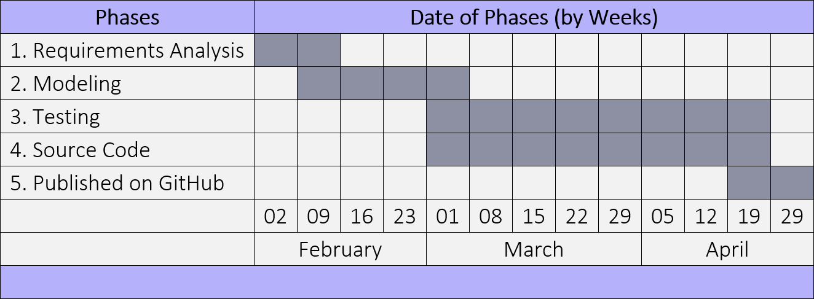

# The Willow Tree OMS

  
Professional Development for Computer Science  
Capstone Project  
 
Mark Sarasua, Jr.  
Ernst Bekkering, Ph.D.  
CS 4233  
Northeastern State University  
 
The repository includes the project proposal, documentation, and source code.  
 
## Hypothetical Case  
A mid-scale restaurant in Tahlequah named The Willow Tree uses an Order Management System (OMS) that enables customers to place orders at their table using a kiosk. However, the OMS has menu items that are limited to those that were available during the initial deployment of the software. The OMS needs an overhaul to reflect current menu changes and allow future updates.  
 
To address the issue, restaurant owner Maria Zabala has approached Code-Logik, a local software development firm, to discuss a redesign solution.  
 
The following documentation will treat the hypothetical case as a real-life business interaction.  
 
## Table of Contents  
1. [Project Proposal](#project-proposal)
    - [Project Timeline](#project-timeline)
8. [Source Code](#source-code)
    - [Agile Development Lifecycle](#agile-development-lifecycle)  

## Project Proposal  

**PROJECT NAME:** The Willow Tree OMS  
**PROJECT REFERENCE:** CS4233 CAPSTONE PROJECT 2024  
**DATE:** 23 JAN 2024  

The Willow Tree’s current Order Management System (OMS) allows customers to place orders at the table via a kiosk.  

Although the current release is functional, the OMS limits menu items to those available during development. A redesign is necessary because the menu now features previously unavailable items.  

The current OMS design has embedded all menu items in the source code and requires a redesign to accommodate future menu items.  

Code-Logik proposes translating the OMS code to a more efficient language to accommodate highly interactive and dynamic content, migrating the menu items to a database for menu customization, integrating logic to connect to the database, and creating a privileged on-demand user interface to manage menu items.  

The proposal aims to deliver The Willow Tree an easily accessible and manageable OMS capable of keeping pace with evolving menu items and providing the customer with the best possible dining experience.  

To complete the redesign of The Willow Tree OMS, Code-Logik estimates a total of 13 weeks from start to finish.  

### Project Timeline  
 

*Figure 1 Expected Timeline for Software Development Life Cycle.*

Redesigning the Order Management System into a customizable dynamic OMS is the goal of this project. The OMS can reliably serve the embedded menu items. However, the OMS provides no flexibility in adding new menu items. Code-Logik will redesign the OMS into a manageable application without requiring a programming expert to customize the menu items. This project will undoubtedly provide The Willow Tree’s customers with the best possible dining experience by allowing It to adjust its menu anytime.  

View the full-length [Project Proposal](docs/project_proposal.pdf) document.  
 
## Source Code  
### Agile Development Lifecycle  
 

* **Concept**
   
    * [The Willow Tree OMS: Concept](https://github.com/users/code-logik/projects/9)
