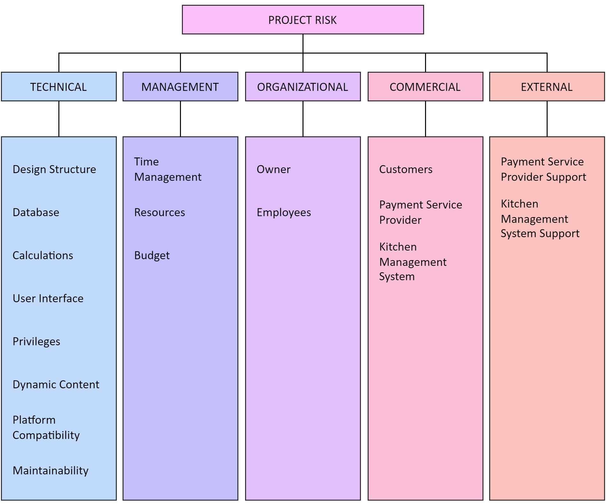
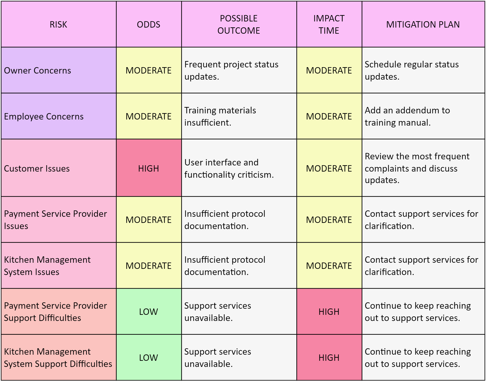
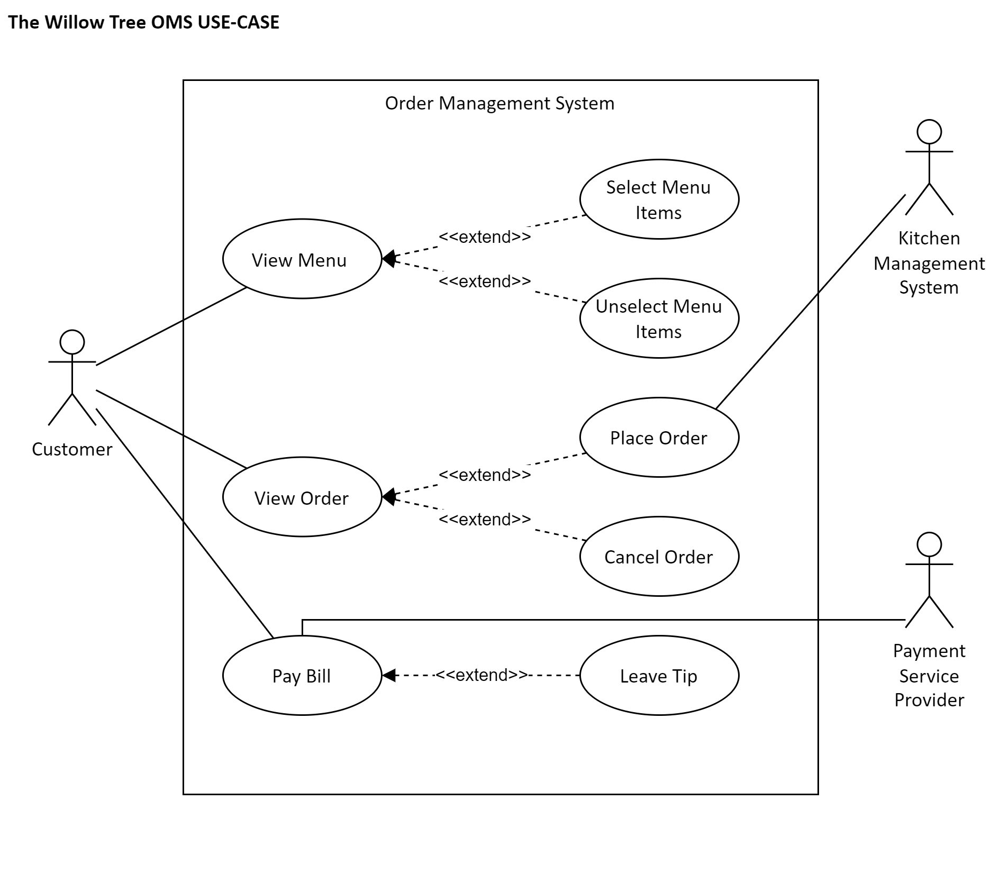
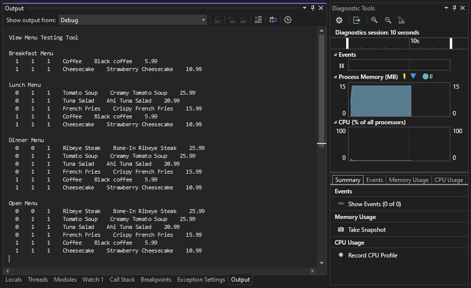

---

# The Willow Tree OMS
[](https://github.com/code-logik/the-willow-tree-oms?tab=MIT-1-ov-file#)
[](https://commonmark.org/)
[](https://github.com/RichardLitt/standard-readme)
[](https://www.microsoft.com/en-us/microsoft-365/word)
[](https://www.adobe.com/acrobat.html)
[](https://www.adobe.com/products/photoshop.html)
[](https://www.drawio.com/)
[](https://visualstudio.microsoft.com/)
[](https://www.json.org/json-en.html)
[](https://www.nuget.org/packages/Newtonsoft.Json/)
[](https://dotnet.microsoft.com/)
[](https://learn.microsoft.com/en-us/dotnet/csharp/)
[](https://learn.microsoft.com/en-us/dotnet/desktop/wpf/advanced/xaml-in-wpf?view=netframeworkdesktop-4.8)
[](https://www.wix.com/)
[](https://www.canva.com/)
[](https://obsproject.com/)

Professional Development for Computer Science  
Capstone Project  
<br>
Mark Sarasua, Jr.  
Ernst Bekkering, Ph.D.  
CS 4233  
Northeastern State University  
<br>
The repository includes the project proposal, documentation, and source code.  
<br>
## Hypothetical Case  
A mid-scale restaurant in Tahlequah called The Willow Tree utilizes a website-based Order Management System (OMS) that allows customers to place orders at their table using a kiosk. However, the OMS has been facing intermittent performance and security issues due to the software's website-based deployment. Therefore, the OMS requires an overhaul to improve its performance and better secure data.  
<br>
To address the issue, restaurant owner Maria Zabala has approached Code-Logik, a local software development firm, to discuss a redesign solution.  
<br>
The following documentation will treat the hypothetical case as a real-life business interaction.  
<br>
## Table of Contents  
1. [Project Proposal](#project-proposal)
2. [Requirements Analysis](#requirements-analysis)
3. [Risk Management](#risk-management)
4. [Modeling](#modeling)
5. [Development](#development)
6. [Testing](#testing)
7. [Source Build](#source-build)
8. [Pre-Built Installer](#pre-built-installer)
9. [Installation](#installation)
10. [Usage](#usage)
11. [License](#license)<br><br>

## Project Proposal  

**PROJECT NAME:** The Willow Tree OMS  
**PROJECT REFERENCE:** CS4233 CAPSTONE PROJECT 2024  
**DATE:** 23 JAN 2024  

The Willow Tree’s current Order Management System (OMS) allows customers to place orders at the table via a kiosk.  

Although the current release is functional, the OMS has been facing intermittent performance and security issues due to its software's website-based deployment. A redesign is necessary to improve the performance and better secure data.  

The current OMS software performance is impacted by circumstances extending beyond The Willow Tree’s scope of business; the hosted source code is also vulnerable to random and targeted security threats and requires a redesign to protect the integrity of The Willow Tree’s day-to-day operations.  

Code-Logik proposes rebuilding the OMS into a desktop application to accommodate the highly interactive usage expected in a restaurant setting. Having the OMS deployed as a desktop application will improve stability and overall performance and reduce the possible footholds available to potential security threats.  

The proposal aims to deliver The Willow Tree a secure, stable, high-performance OMS capable of keeping pace with restaurant business demands while providing the customer with the best possible dining experience.  

Code-Logik estimates that it will take approximately 13 weeks to complete the redesign of The Willow Tree OMS.  
<br>

*Figure 1 Expected Timeline for Software Development Life Cycle.*  

This project aims to redesign the Order Management System from a website-based into a desktop-based application. The current OMS is functional; however, the customers' dining experience continues to suffer with intermittent performance and security issues. Code-Logik will redesign the OMS into a secure, stable, high-performance application that will undoubtedly provide The Willow Tree’s customers with the best possible dining experience.  

View the full-length [Project Proposal](docs/project_proposal.pdf) document.  
<br>
## Requirements Analysis  
**OBJECTIVE:** Redesign The Willow Tree’s Order Management System (OMS) to create a secure, stable, high-performance application capable of keeping pace with restaurant business demands while providing the customer with the best possible dining experience.  

**PROBLEM STATEMENT:** The current OMS software performance is impacted by circumstances extending beyond The Willow Tree’s scope of business; the hosted source code is also vulnerable to random and targeted security threats and requires a redesign to protect the integrity of The Willow Tree’s day-to-day operations.  
<br>
**FUNCTIONAL REQUIREMENTS**  
<br>
**Design and Structure**  
- Header with The Willow Tree branding and a brief description.
- Navigation Bar for customers to view menu items by logical categories.  
- Order Summary section to list selected items.  
- Receipt section to detail final order.<br>

**Menu Items and Selection**
- Categorize menu items into logical sections.
- Each menu item includes an image, brief description, and price.
- Customers can select and deselect menu items.<br>

**Order Summary**  
- List each selected item with the cost.
- Subtotal all selected items together.
- Update totals in real-time as customers make selections.
- Button to cancel the order.<br>

**Receipt**  
- Name of server and table number.
- List selected items, including item name, quantity, and price.
- Customers can specify the tip amount.
- Detail subtotal, tax, tip, and total cost.
- Method of payment.
- Display a “Thank You” message.<br><br>

**ASSUMPTIONS & CONSTRAINTS**  
- Payment Service Provider: OMS is compatible with payment processing software.
- Kitchen Management System: OMS is compatible with order placement software.
- Budget: $25,000<br><br>

View the full-length [Requirements Analysis Document](docs/requirements_analysis.pdf).  
<br>
## Risk Management  
**SUMMARY:** Risk management will be conducted throughout the Software Development Life Cycle (SDLC) via identification, assessment, and registration. The risk management process reduces time spent resolving foreseen and unforeseen risks, boosting productivity and allowing more time for quality work.  

**PURPOSE:** The Risk Management Plan (RMP) will serve as the controlling document to manage and mitigate risks during the SDLC of The Willow Tree OMS project. The RMP seeks early identification of risks using assessment techniques to create a Risk Register (RR) with mitigation planning. Following the creation of the initial RR, any subsequent risks identified or issue tracking will be added to the RMP through addendums.  
<br>
**IDENTIFICATION**    
<br>

*Figure 2 Risk Breakdown Structure Diagram*  

The project scope has been divided into five subcategories to help identify possible risks. Each subcategory focuses on different areas of concern, as shown in Figure 2. The RR will be prepared based on the identified risks and will include a mitigation plan for each risk identified.  
<br>
**RISK REGISTER**  
<br>

*Figure 3 Risk Register Diagram*  

The RR details the potential risks associated with The Willow Tree OMS project (Figure 3). This list is not exhaustive and will be updated and revised as needed throughout the SDLC.  

View the full-length [Risk Management Plan](docs/risk_management_plan.pdf) document.  
<br>
## Modeling  
**USER STORIES**  
<br>

*Figure 4 User Story 1*  

To view all 8 User Stories, see the full-length [Modeling](docs/modeling.pdf) document.  
<br>

**USE-CASE DIAGRAM**  
<br>

*Figure 5 Use-Case Diagram*  
<br>

**CLASS DIAGRAMS**  
<br>

*Figure 6 View Menu Class Diagram*  

To view all 5 Class Diagrams, see the full-length [Modeling](docs/modeling.pdf) document.  
<br>

**ACTIVITY DIAGRAM**  
<br>


*Figure 7 Customer Activity Diagram*  
<br>

**DEPLOYMENT DIAGRAM**  
<br>


*Figure 8 Deployment Diagram*  

View the full-length [Modeling](docs/modeling.pdf) document.  
<br>
## Development  
**AGILE DEVELOPMENT LIFECYCLE**  
<br>
**Concept**  
- [Project](https://github.com/users/code-logik/projects/9) | [Branch](https://github.com/code-logik/the-willow-tree-oms/tree/agile/concept-phase/1)<br>

**Inception**  
- [Project](https://github.com/users/code-logik/projects/10) | [Branch](https://github.com/code-logik/the-willow-tree-oms/tree/agile/inception-phase/2)<br>

**Iteration**  
1. [Project](https://github.com/users/code-logik/projects/11) | [Branch](https://github.com/code-logik/the-willow-tree-oms/tree/agile/iteration-phase/3-1)
2. [Project](https://github.com/users/code-logik/projects/12) | [Branch](https://github.com/code-logik/the-willow-tree-oms/tree/agile/iteration-phase/3-2)
3. [Project](https://github.com/users/code-logik/projects/13) | [Branch](https://github.com/code-logik/the-willow-tree-oms/tree/agile/iteration-phase/3-3)<br>

**Release**  
- [Project](https://github.com/users/code-logik/projects/15) | [Branch](https://github.com/code-logik/the-willow-tree-oms/tree/agile/release-phase/4)<br><br>

## Testing
**VIEW MENU TEST**  
<br>
To test the correctness of the View Menu Iteration, a simple JSON database consisting of six menu items (Figure 9) was used in conjunction with code specific to testing (Figure 10).<br><br>  

```
  ...
  {
    "Name": "Coffee",
    "Image": "none",
    "Description": "Black coffee",
    "Category": 4,
    "Price": 5.99,
    "Period": [
      true,
      true,
      true
    ]
  },
  ...
```
*Figure 9 [JSON Database](test/ViewMenuTestTool/Database/Menu.json)*
<br><br>

```
  ...
  Menu menu = new Menu();
  List<List<MenuItem>> current_menu = new List<List<MenuItem>>();

  Console.WriteLine("Breakfast Menu\n");
  current_menu = menu.current_menu(PERIOD.Breakfast);
  foreach (List<MenuItem> category in current_menu)
  {
    foreach (MenuItem item in category)
    {
      Console.WriteLine
      (
        $"  {Convert.ToInt32(item.Period[0])}  " +
        $"  {Convert.ToInt32(item.Period[1])}  " +
        $"  {Convert.ToInt32(item.Period[2])}  " +
        $"  {item.Name}  " +
        $"  {item.Description}  " +
        $"  {item.Price}  "
      );
    }
  }
  Console.WriteLine("\n");
  ...
```
*Figure 10 [Test Specific Code](test/ViewMenuTestTool/Program.cs)*
<br><br>
The expected console output was a multi-period display of the six menu items in the JSON database. Since the console output was what was expected (Figure 11), the View Menu Test is considered a success. Therefore, the View Menu Iteration was closed, and the Customer User Interface Iteration was opened.  
<br>

  
*Figure 11 View Menu Test Console Output*  

View the full-length [Testing](docs/testing.pdf) document.  
<br>
## Source Build  
To build from source code:  
1. Download the [latest release](https://github.com/code-logik/the-willow-tree-oms/releases) and unpack.
2. Navigate to the src directory and then to the TheWillowTreeOMS subdirectory.
3. Open the TheWillowTreeOMS.sln in Visual Studio 2022.
4. Select **Build > Batch Build** in the menu bar.
5. Locate the *Release Configurator* of the *CustomerUserInterface Project* and check the **Build** checkbox.
6. Locate the *Release Configurator* of the *TheWillowTreeOMS Project* and check the **Build** checkbox.
7. Click the **Build** button.
8. Navigate to the Release folder to find the **setup.exe** and **TheWillowTreeOMS.msi**.<br><br>

## Pre-Built Installer  
To download the pre-built installer:  
1. Download the [latest release](https://github.com/code-logik/the-willow-tree-oms/releases) and unpack.
2. Navigate to the build directory to find the **setup.exe** and **TheWillowTreeOMS.msi**.<br><br>

## Installation  
To install The Willow Tree OMS:  
1.	Run **setup.exe** to start the Setup Wizard and click **Next**.
2.	Select an installation folder or use the default *Desktop* location for ease of use.
3.	Select **Everyone** and click **Next**.
4.	Click **Next** to start the installation.
5.	Click **Close** to complete the installation.<br>

**FILES INSTALLED**  

  
*Figure 12 Files Installed*  
<br>
## Usage  
**PREREQUISITE:** TheWillowTreeOMS (OMS.exe) is actively running.<br><br>
**How to Use:**
1. Tap anywhere on the Splash Screen to start a new order.
2. Tap **ENTREES**, **SIDES**, **DESSERTS**, or **DRINKS** to view the corresponding menu category menu items.
3. Tap the menu item **➕** or **➖** button to add or remove the item from your order.
4. Tap **ORDER** to send the selected menu items to the Kitchen Management System (KMS) or **CANCEL** to cancel the order altogether.
   - The ticket is still open, and additional menu items may be selected.
5. Tap **PAY BILL** to close the current order and pay the balance.
   - The ticket is closed, and no further menu items may be selected.
6. Tap **CASH** to notify the server to collect payment or **CREDIT** to use the kiosk card reader.
   - The **Tip Server** modal is displayed.
7. Tap one of the predetermined percentages, **10%**, **15%**, **20%**, or **25%**, or tap and drag the Slider to set the dollar amount.
8. Tap **ADD TIP** to add the dollar amount shown to the current balance or **NO TIP** to pay just the order balance.
9. Tap **PAY NOW** to complete the transaction and return to the Splash Screen.<br><br>

**SHUTDOWN:** Attach a USB keyboard to the kiosk and press the **ESC** to exit the program.<br><br>

## License  
The Willow Tree OMS is licensed under the [MIT License](https://github.com/code-logik/the-willow-tree-oms?tab=MIT-1-ov-file#).<br>
```
MIT License

Copyright (c) 2024 Mark Sarasua, Jr. <mark.sarasua@code-logik.com> www.code-logik.com

Permission is hereby granted, free of charge, to any person obtaining a copy
of this software and associated documentation files (the "Software"), to deal
in the Software without restriction, including without limitation the rights
to use, copy, modify, merge, publish, distribute, sublicense, and/or sell
copies of the Software, and to permit persons to whom the Software is
furnished to do so, subject to the following conditions:

The above copyright notice and this permission notice shall be included in all
copies or substantial portions of the Software.

THE SOFTWARE IS PROVIDED "AS IS", WITHOUT WARRANTY OF ANY KIND, EXPRESS OR
IMPLIED, INCLUDING BUT NOT LIMITED TO THE WARRANTIES OF MERCHANTABILITY,
FITNESS FOR A PARTICULAR PURPOSE AND NONINFRINGEMENT. IN NO EVENT SHALL THE
AUTHORS OR COPYRIGHT HOLDERS BE LIABLE FOR ANY CLAIM, DAMAGES OR OTHER
LIABILITY, WHETHER IN AN ACTION OF CONTRACT, TORT OR OTHERWISE, ARISING FROM,
OUT OF OR IN CONNECTION WITH THE SOFTWARE OR THE USE OR OTHER DEALINGS IN THE
SOFTWARE.
```

---

