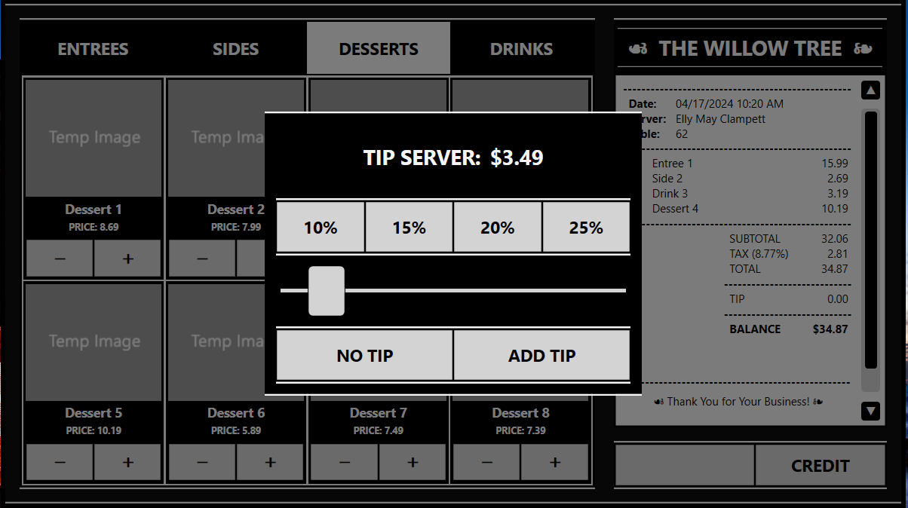

---

## Iteration Tests
**Retrieve Menu Items Test**  
- [Source Code](RetrieveMenuItemsTestTool) 

*Retrieve Menu Items Test Tool Results*  

**View Menu Test**  
- [Source Code](ViewMenuTestTool) 

*View Menu Test Tool Results*  

**Customer User Interface UAT**  
- [Source Code](test/CustomerUserInterfaceUAT) 

*Customer User Interface Pre-Order GUI State*  

*Customer User Interface Post-Order GUI State*  

*Customer User Interface Add Tip GUI State*  

*CustomerUser Interface Process Payment GUI State*  

___

